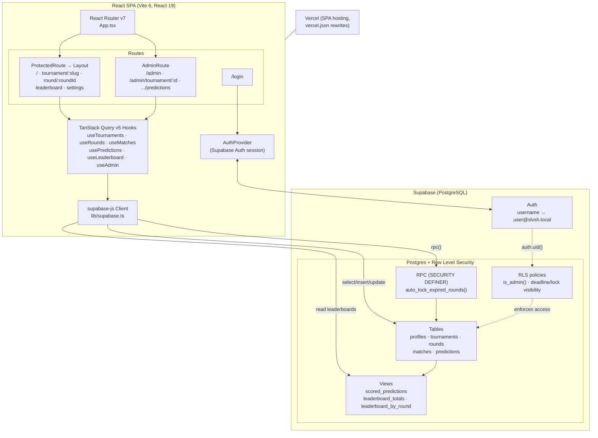

# SLVSH Bets


A prediction game for head-to-head ski tournaments. Users forecast the winner of
each match and the winner's letter score, and compete on per-round and overall
leaderboards.

<!-- TODO: screenshot/GIF -->

## Tech Stack

- **Frontend:** React 19, TypeScript 5.7, Vite 6
- **Backend / Auth / Database:** Supabase (PostgreSQL, Auth, Row Level Security)
- **Data fetching:** TanStack React Query v5
- **Forms & validation:** React Hook Form + Zod
- **Routing:** React Router v7
- **Styling:** Tailwind CSS 3.4
- **Utilities:** date-fns, clsx
- **Deployment:** Vercel

## Features

- Username/password authentication via Supabase Auth. Users sign in with a
  **username** (the "Username" field on the login screen), which is mapped
  internally to a synthetic email address `${username}@slvsh.local` before it is
  passed to Supabase Auth's password sign-in.
- Tournaments organized into rounds and matches
- Per-match predictions: pick the winner and the winner's letter score. The
  letter score is one of `Clean` (no letters), `S`, `SL`, `SLV`, or `SLVS`
  (`Clean` is stored as `NULL` in the database).
- Scoring engine (max 3 points per match):

  | Outcome                                     | Points |
  | ------------------------------------------- | :----: |
  | Correct winner                              |   1    |
  | Correct winner **and** correct letter score |  +2    |
  | **Maximum per match**                       | **3**  |

  Letter points only count when the predicted winner is also correct.

- Deadline- and lock-based prediction visibility: predictions are private until a
  round is locked, then revealed to everyone. Rounds are locked automatically
  once their deadline passes, via a `SECURITY DEFINER` database function
  (`auto_lock_expired_rounds`) that any signed-in user can trigger.
- Overall and per-round leaderboards (backed by SQL views)
- Admin area to manage tournaments, rounds, matches, results, and predictions
- Role-based access enforced both in the UI and via Postgres Row Level Security
  (an `is_admin()` helper drives the policies)

## Architecture



## Getting Started

### Prerequisites

- Node.js 20+ and npm
- A Supabase project
- The [Supabase CLI](https://supabase.com/docs/guides/cli) (for applying migrations)

### 1. Install dependencies

```bash
npm install
```

### 2. Configure environment variables

Copy the example file and fill in your Supabase project values:

```bash
cp .env.local.example .env.local
```

```env
VITE_SUPABASE_URL=https://your-project-id.supabase.co
VITE_SUPABASE_ANON_KEY=your-anon-key
```

The `anon` key is safe to expose in the client; all data access is guarded by
Row Level Security.

### 3. Set up the database

The repository does not ship a `supabase/config.toml`, so initialize and link
the CLI to your project first, then push the migrations from
`supabase/migrations/`:

```bash
supabase init      # only if no local Supabase config exists yet
supabase link --project-ref your-project-id
supabase db push
```

Alternatively, run each migration file in `supabase/migrations/` in order via the
Supabase SQL editor.

### 4. Run the development server

```bash
npm run dev
```

### 5. (Optional) Seed demo data

`scripts/seed.ts` creates demo users, a sample tournament, rounds, matches, and
predictions. It requires a **service_role** key (local use only — never commit
it) and reads `VITE_SUPABASE_URL` from `.env.local`. The demo user password is
taken from the optional `SEED_PASSWORD` environment variable (with a built-in
fallback):

```bash
SUPABASE_SERVICE_ROLE_KEY=... SEED_PASSWORD=your-demo-password \
  npx tsx scripts/seed.ts
```

Demo users sign in with their username (e.g. their name), which is mapped to
`username@slvsh.local` under the hood.

### Available scripts

| Command                           | Description                                                                 |
| --------------------------------- | --------------------------------------------------------------------------- |
| `npm run dev`                     | Start the Vite development server                                           |
| `npm run build`                   | Type-check and build for production                                        |
| `npm run preview`                 | Preview the production build locally                                       |
| `npx tsx scripts/seed.ts`         | Seed demo data (needs `SUPABASE_SERVICE_ROLE_KEY`, optional `SEED_PASSWORD`) |
| `npx tsx scripts/fix-henderson.ts`| One-off maintenance script to correct legacy match player names            |

> The `scripts/` helpers use the service_role key and bypass RLS. Only run them
> locally against your own project.

## Project Structure

```
src/
  components/   Reusable UI components
  pages/        Route-level pages (dashboard, tournament, round, leaderboard, admin, settings, ...)
  hooks/        Custom hooks wrapping Supabase queries and mutations
  lib/          Supabase client, React Query client, utilities (e.g. letter helpers)
  schemas/      Zod validation schemas
  types/        Shared TypeScript types (incl. generated Supabase types)
scripts/        Node/tsx maintenance scripts (seeding, data fixes)
supabase/
  migrations/   PostgreSQL schema, views, functions, and RLS policies
public/         Static assets
```

The app is a single-page application; `vercel.json` rewrites all routes to
`index.html` for client-side routing.

## License

Released under the [MIT License](LICENSE).
